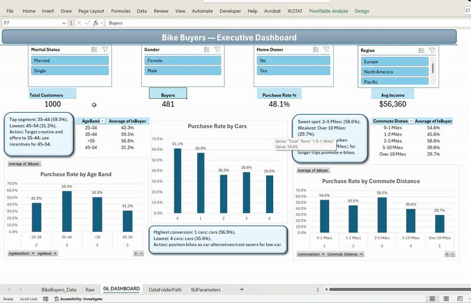
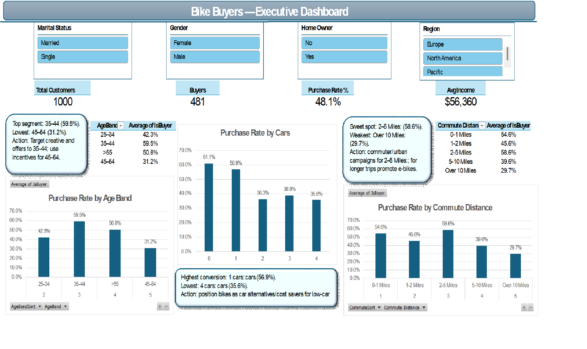

# Bike Buyers — Executive Dashboard (Excel, Power Query)

**Goal.** Show professional Excel analytics: automated import (From Folder), feature engineering in Power Query, and an interactive executive dashboard.

## What’s inside
- **ETL (Power Query):** parameterized folder path, **Trim & Clean**, typed columns.
- **Features:** `AgeBand`, `AgeBandSort`, `CommuteSort`, `IsBuyer` (Yes → 1, No → 0).
- **Dashboard:** 4 KPIs (Total, Buyers, Purchase Rate %, Avg Income), 3 PivotCharts (by Age Band / Cars / Commute Distance), slicers (Marital Status, Gender, Home Owner, Region).
- **Insight boxes:** dynamic text linked to `GETPIVOTDATA`.

## Data
Source: Kaggle — “Bike Buyers” (~1,000 rows).  
If the dataset license restricts redistribution, download it from Kaggle and place the CSV into the `Raw/` folder.

## How to run
1. Clone or download this repo.
2. Open `BikeBuyer_Dashboard.xlsx`.
3. In sheet **`tblParameters`**, set `DataFolderPath` to your local path of `Raw/`.
4. **Data → Refresh All**.
5. Use the slicers; KPIs, charts, and insight boxes update dynamically.

## Key findings (sample)
- Best segment: **Age 35–44**.
- Higher conversion at **≤ 5 miles** commute.
- **0–1 cars** households convert higher.

## Notes
- Drill-down is disabled to avoid stray detail sheets.
- Custom sorting by `AgeBandSort` & `CommuteSort`.
- The PDF (`BikeBuyer_Dashboard.pdf`) is a one-page export (Landscape, Fit to 1 page).

**Live files:**  
- [Download Excel (.xlsx)](BikeBuyer_Dashboard.xlsx)  
- [One-page PDF](BikeBuyer_Dashboard.pdf)

---

